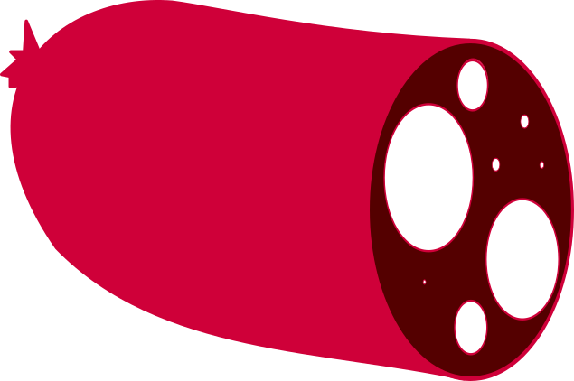

# SoSyS

## The project

SoSyS, short for Solar System on the Surface is a project with one goal, to allow people to comprehend the size of the solar system. It does not aim to represent every detail of our solar system, but enough to make it recognisable. It should be easy to use. For this project it is more important to reach as many people as possible instead of having every detail correct.

In 2015, some guys (link [here]) built a model of the solar system in the Nevada desert. They were part of the inspiration for this project. The downside of their effort is that it is non-permanent and (extremely) local. SoSyS aims to be more permanent (even though virtual) and available to everyone.

Step #1 (this first effort) is to provide a "linear" solar system (where all planets are aligned on one side of the sun). A situation that does occur, although not that frequently, but is easy to understand and (more importantly for step #1) to represent. No moons will be present in step #1 except for our own.

In consecutive steps a more realistic representation of the solar system should be attempted, aiming for a representation of the "current" situation. Moons of other planets and celestial objects can be added in next iterations as well.

One liberty this project will always take has to do with representing the solar system on earths surface. This project was started in Belgium (which is quite flat) and allows to represent the solar system on a "flat canvas". However other regions are more contoured and it would not do to represent the solar system with planets inside hills and mountains or several 100 meters up into the sky, where nobody can see them.

A audience that is definitely targeted by SoSyS are students. Which is why everything is scaled based on a "standard" classroom globe (about 30 centimeters / 12 inches) of earth.
